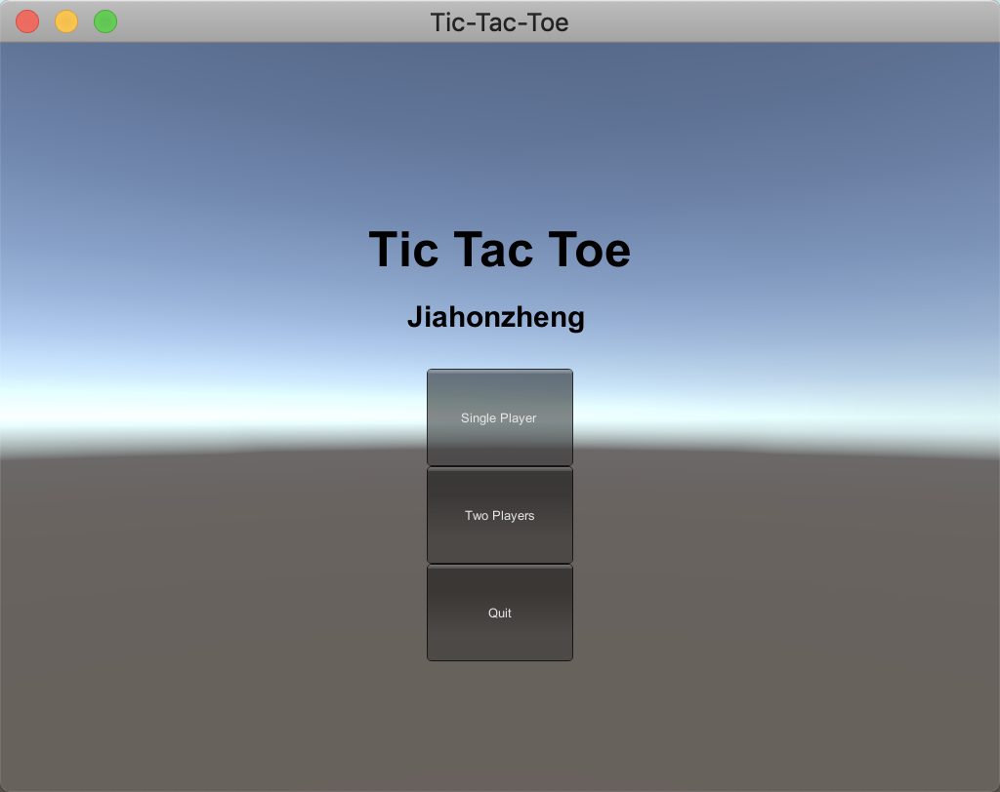
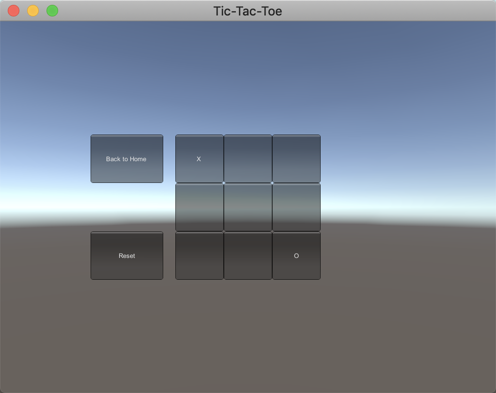

# Unity 3D Learning

> HW1 井字棋

博客链接：[离散仿真引擎基础](https://blog.jiahonzheng.cn/2019/09/07/%E7%A6%BB%E6%95%A3%E4%BB%BF%E7%9C%9F%E5%BC%95%E6%93%8E%E5%9F%BA%E7%A1%80/) 。

在线预览：[demo.jiahonzheng.cn/Tic-Tac-Toe](https://demo.jiahonzheng.cn/Tic-Tac-Toe/) 。

预览视频：[Unity 井字棋游戏演示](https://www.bilibili.com/video/av67382077/) 。

## 实现功能

- 单人模式
- 双人模式

## 运行截图

主菜单页面如下。

游戏主页面如下。

